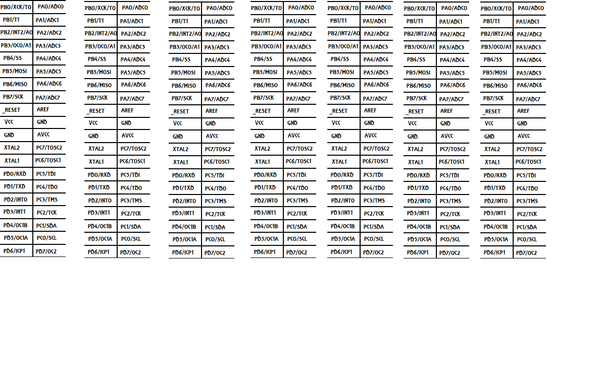

# synthUI_AVR

This repo has code for AVR to implement the user
interface controls for a Teensy 4 based synth

T4 itself does not have many pins (and quite a
few are involved in the audio interface so the
original plan was to use port multiplexers but
this still injected a lot of noise to Tiny and
was cumbersome - so mop all the IO up with a
40 pin AVR.

The first thought was to use mega32 (because I
had one) but then I considered mega1284P simply
because i had a Mega1284P-Xplained board at hand
but I may revert to mega32 in fact.

Rather curiously I decided to dabble in C++ for
this. I quite like the way the Button, Encoder,
DualJoystick classes turned out so far.

Oh and to help me connect up the mega32 I 
produced this label to stick onto the chip
(print to be 51mm long)...

